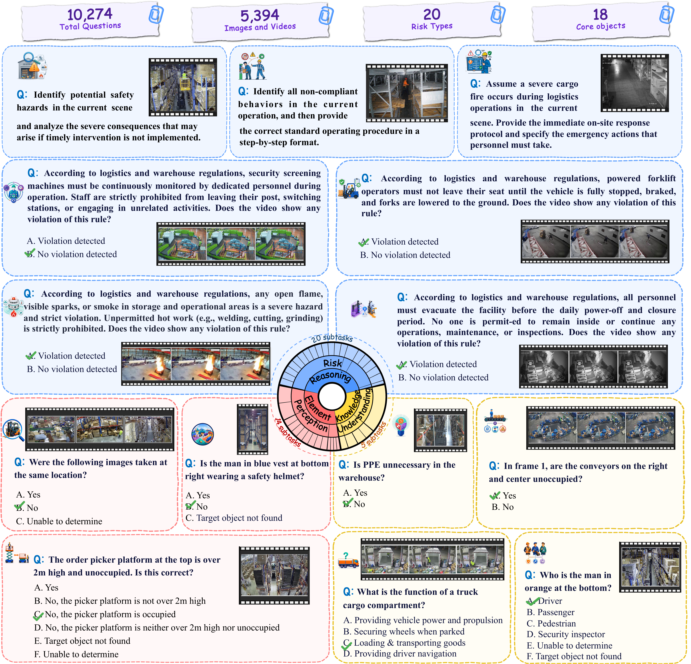
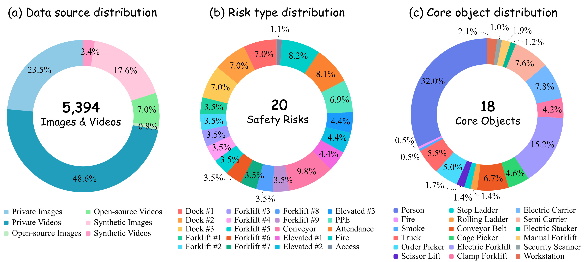
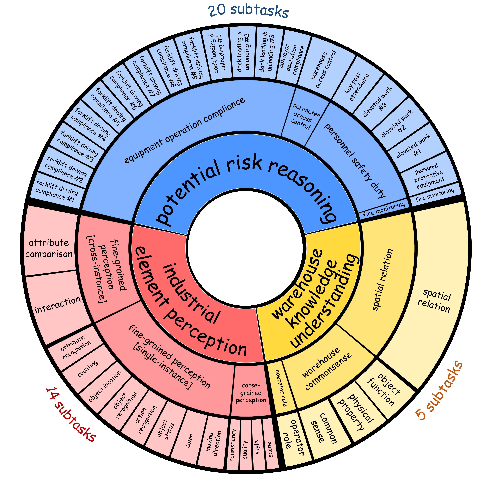

# LogiScope-VQA-benchmark

<div align="center">

<h1>LogiScope-VQA</h1>

<p><strong>Benchmarking Vision-Language Models for Logistics Hazard Identification<br> in Industrial Scenarios</strong></p>

<a href=""></a>
<a href="https://huggingface.co/datasets/zhouhanjing/LogiScope-VQA"></a>
<a href="./LICENSE"></a>
<a href="./CODE_LICENSE"></a>

</div>

---

## 🔍 Introduction

**LogiScope-VQA** is the first dedicated benchmark for evaluating Large Multimodal Models (LMMs) on **logistics hazard identification** in real-world industrial scenarios.

Built from **3.5 million surveillance clips** collected over one year across the global warehouse parks of Cainiao, a leading intelligent logistics company, LogiScope-VQA provides:

- 📦 **2,476 images & 2,918 video clips** primarily from private warehouse surveillance, complemented by open-source and synthetic data (covering high-rack areas, loading docks, storage zones, picking shelves, security screening areas, day/night scenes, etc.)
- ❓ **10,274 human-validated VQAs** in multiple-choice and open-ended formats
- 🎯 **18 core objects** and **20 risk types** grounded in real-world warehouse safety regulations
- 💡 **Key findings** — fine-grained perception remains a major bottleneck, and safety risk bias is pervasive yet overlooked



## 📊 Dataset Overview

LogiScope-VQA comprises **5,394 high-quality visual samples** (2,476 images and 2,918 video clips) and **10,274 VQA pairs**. The visual corpus mixes private surveillance footage (the majority), open-source data, and synthetic samples (produced via image editing to enrich rare risk factors). Every VQA pair has undergone three-round expert cross-validation, and the final release is rebalanced across core objects, risk types, and hallucination rates to mitigate long-tail skew.




The full task taxonomy spans three levels: **3 competency dimensions → 10 tasks → 39 subtasks**, organized as a progressive curriculum from visual perception to risk reasoning:

1. **Industrial Element Perception** — fine/coarse-grained perception of dense, low-resolution surveillance targets
2. **Warehouse Knowledge Understanding** — commonsense, spatial relations, and operator roles
3. **Potential Risk Reasoning** — perimeter access control, fire monitoring, personnel safety duty, and equipment operation compliance

<div align="center">

</div>


## 🚀 Getting Started

The dataset is available on HuggingFace:

🔗 **[https://huggingface.co/datasets/zhouhanjing/LogiScope-VQA](https://huggingface.co/datasets/zhouhanjing/LogiScope-VQA)**

```bash
# Load the dataset via 🤗 datasets
pip install datasets
```

```python
from datasets import load_dataset

dataset = load_dataset("zhouhanjing/LogiScope-VQA")
```


## 💡 Key Findings

- **Fine-grained perception remains a major bottleneck.** Models struggle with low-resolution, wide-angle, heavily occluded, and densely cluttered surveillance footage, falling below even novice humans on fine-grained perception tasks.
- **Safety risk bias is a significant yet overlooked issue.** Most models exhibit a prevalent conservative (over-reporting) bias, and even the strongest models fall far short of industrial production-grade readiness and fall far below human experts.


## 📑 Citation

If you find LogiScope-VQA useful in your research, please cite:

```bibtex
@article{zhou2026logiscope,
  title   = {LogiScope-VQA: Benchmarking Vision-Language Models for Logistics Hazard Identification in Industrial Scenarios},
  author  = {Zhou, Hanjing and Yin, Mingze and Lian, Ying and Ma, Jun and Hsieh, Chang-Yu and Chou, Yanbing},
  journal = {arXiv preprint arXiv:TODO},
  year    = {2026}
}
```

## 📜 License

This repository adopts a **dual-license** scheme:

| Scope | License | File |
| --- | --- | --- |
| Dataset (images, videos, VQAs, annotations, and other data assets) | [CC BY-NC-SA 4.0](https://creativecommons.org/licenses/by-nc-sa/4.0/) | [LICENSE](./LICENSE) |
| Code (evaluation scripts, utilities, and other source code) | [MIT](https://opensource.org/license/mit) | [CODE_LICENSE](./CODE_LICENSE) |

## 🤝 Acknowledgement

We thank all the logistics experts and annotators who contributed to the annotation effort, and all warehouse parks that provided surveillance data for this benchmark.
